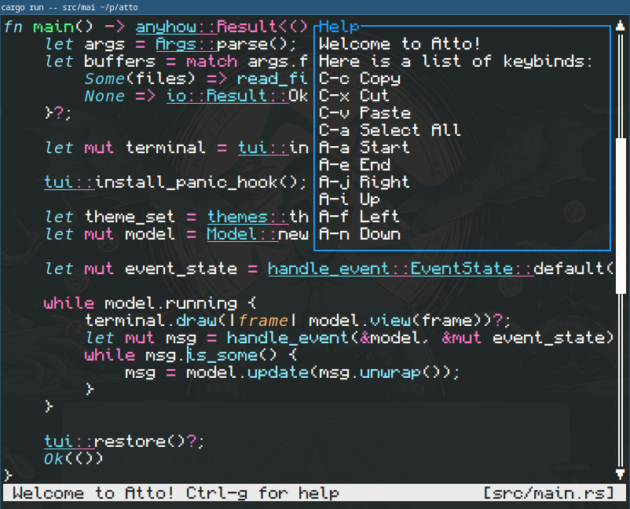

Atto is an experimantal terminal editor that focuses on key modifiers rather than modes.
It leverages the https://sw.kovidgoyal.net/kitty/keyboard-protocol/[kitty protocol] which has been
https://github.com/alacritty/alacritty/commit/cb03806e2ab85674c45e87e1bb24dfe2fd1a918c[supported by Alacritty] since v0.13.0.
This means that you may have to use kitty or compile alacritty to use this editor.

